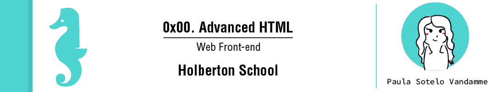

# Learning Objectives
At the end of this project, you are expected to be able to explain to anyone, without the help of Google:

> - Which guidelines to follow for HTML
> - How to create the skeleton of an HTML5 page
> - How to use semantic HTML tags to structure a web page
> - Which use cases to use div vs span
> - The semantic value’s of header, main, footer, article, nav, section, aside
> - How to use headings (and why it’s important to follow the hierarchical order)
> - How to make lists in HTML
> - The differences between medias (SVG, GIF, PNG, JPG)
> - How to structure data in a table
> - How to integrate a video in a webpage
> - How to integrate an audio file in a webpage
> - How to embed external content
> - How to correctly structure an HTML page

# Requirements

> - A README.md file at the root of the folder of the project is mandatory
> - Your code should be W3C compliant and validate with W3C-Validator
> - Techium will be the name of the company we will use across our webpages.

## Sitemap of the project

## Wireframe of Techium project

# Tasks

**0. Create your first webpage**
File: [0-index.html](0-index.html/)

**1. Structure your webpage**
File: [1-index.html](1-index.html/)

**2. The head - meta charset, viewport, title, description, favicons**
File: [2-index.html](2-index.html/)

**3. Simple header, main, footer**

File: [3-index.html](3-index.html/)
**4. Aside**

File: [article.html](article.html/)
**5. Section**

File: [5-index.html](5-index.html/)
**6. Work, News, Testimonial articles**

File: [6-index.html](6-index.html/)
**7. Navigation**

File: [7-index.html](7-index.html/)
**8. Level 1 headings**

File: [8-index.html](8-index.html/)
**9. Level 2 headings**

File: [9-index.html](9-index.html/)
**10. Level 3 headings**

File: [10-index.html](10-index.html/)
**11. styleguide**

File: [11-styleguide.html](11-styleguide.html/)
**12. Paragraphs**

File: [12-index.html](12-index.html/)
**13. styleguide paragraphs**

File: [13-styleguide.html](13-styleguide.html/)
**14. Span**

File: [14-index.html](14-index.html/)
**15. Div**

File: [15-index.html](15-index.html/)
**16. Structure your sections**

File: [16-index.html](16-index.html/)
**17. Comments**

File: [17-index.html](17-index.html/)
**18. link your logo**

File: [18-index.html](18-index.html/)
**19. Create new pages**

File: [about.html](about.html/) - [latest_news.html](latest_news.html/) - [contact.html](contact.html/)
**20. Add links**

File: [20-index.html](20-index.html/)
**21. Add social media links**

File: [21-index.html](21-index.html/)
**22. "Button" links**

File: [22-index.html](22-index.html/)
**23. Services, Works, Latest news links**

File: [23-index.html](23-index.html/)
**24. List the links**

File: [24-index.html](24-index.html/)
**25. Secondary navigation menu**

File: [25-index.html](25-index.html/)
**26. Examples of lists for the styleguide**

File: [26-styleguide.html](26-styleguide.html/)
**27. Separate content**

File: [27-index.html](27-index.html/)
**28. Horizontal rule example**

File: [28-styleguide.html](28-styleguide.html/)
**29. Client quotes**

File: [29-index.html](29-index.html/)
**30. Examples of quotes**

File: [30-styleguide.html](30-styleguide.html/)

**31. Address and latest news authors**

File: [31-index.html](31-index.html/)
**32. Typography section - using the correct tags**

File: [32-styleguide.html](32-styleguide.html/)
**33. Table**

File: [33-styleguide.html](33-styleguide.html/)
**34. Details**

File: [34-styleguide.html](34-styleguide.html/)
**35. Replace text logo with image logo**

File: [35-index.html](35-index.html/)
**36. Add images to your sections**

Fiel: [36-index.html](36-index.html/)
**37. Social icons**

File: [index.html](index.html/)
**38. Add a video player in the styleguide**

File: [38-styleguide.html](38-styleguide.html/)
**39. Add an audio player in the styleguide**

File: [39-styleguide.html](39-styleguide.html/)
**40. Add a iframe example in the styleguide**

File: [styleguide.html](styleguide.html/)

# Author

> Paula Sotelo Vandamme

> [E-mail](omeinsotelo@gmail.com)

> [Github](https://github.com/omeinsotelo)

> [Twiiter](https://twitter.com/omeinsotelo)

> [Linkedin](https://twitter.com/omeinsotelo)
