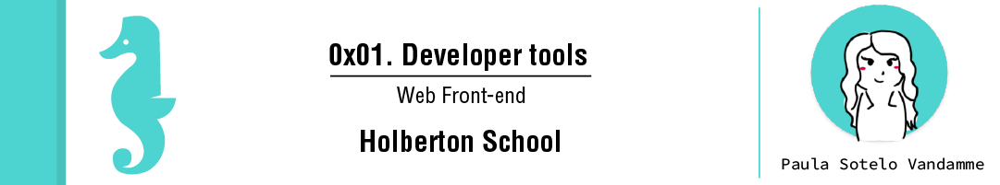

# Learning Objectives
At the end of this project, you are expected to be able to explain to anyone, without the help of Google:
## General
> - What Developer Tools in your browser are
> - How to open the Developer Tools on Chrome, Firefox, Safari, and Edge.
> - How to use the elements tab to edit HTML and CSS
> - How to audit a page according to the tips suggested by Lighthouse
> - How to create and run snippets on a page
> - How to get information about files and server configurations
> - How to block requests
> - How to know how much JavaScript or CSS is used on a page
> - How to detect 404 issues
> - How to move elements on a webpage

# Requirements
## General
> - A README.md file, at the root of the folder of the project, is mandatory
> - Use the newest version of Google Chrome browser (78.0.3904.70 or later).
> - Screenshots can be taken via the OS, not necessary via the DevTools. These screenshots are used to see how and where you are doing/playing with the DevTools.

# Tasks

**0. Responsive device**
File: [0-responsive_device.png](0-responsive_device.pngl/)

**1. Change the background color**
File: [1-change_bg_color.png](1-change_bg_color.png/)

**2. Force element state**
File: [2-pathways_menu.png](2-pathways_menu.png/)

**3. Copy all the styles of the button**
File: [3-button_styles](3-button_styles/)

**4. Change button styles**
File: [4-new_buttons.png](4-new_buttons.png/)

**5. Remove part of the website**
File: [5-deleted_elements.png](5-deleted_elements.png/)

**6. Where is it coming from?**
File: [6-declaration_file](6-declaration_file/)

**7. How many listeners**
File: [7-number_of_listeners](7-number_of_listeners/)

**8. What is the HSL code**
File: [8-hsl](8-hsl/)

**9. The max-width of the container**
File: [9-max_width](9-max_width/)

**10. Moving around**
File: [10-moved_around.png](10-moved_around.png/)

**11. Coverage**
File: [11-coverage](11-coverage/)

**12. Emulate the print version of the webpage**
File: [12-print_version.png](12-print_version.png/)

**13. Using the console**
File: [13-logo_dollar0](13-logo_dollar0/)

**14. Write code in the console**
File: [14-doc_title](14-doc_title/)

**15. Holberton web framework**
File: [15-hbtn_framework](15-hbtn_framework/)

**16. Homepage weight**
File: [16-weight.png](16-weight.png/)

**17. Number of requests**
File: [17-requests.png](17-requests.png/)

**18. Number of CSS files**
File: [18-css_loaded](18-css_loaded/)

**19. Number of images**
File: [19-images_loaded](19-images_loaded/)

**20. Favicon image type**
File: [20-favicon_type](20-favicon_type/)

**21. Font library**
File: [21-hbtn_font_lib](21-hbtn_font_lib/)

**22. XHR calls**
File: [22-xhr_calls](22-xhr_calls/)

**23. Audits panel**
File: [23-performance_audit.png](23-performance_audit.png/)

**24. Static assets**
File: [24-static_assets_audit.png](24-static_assets_audit.png/)

**25. Accessibility**
File: [25-contrast_issue](25-contrast_issue/)

**26. No alt**
File: [26-no_alt](26-no_alt/)

**27. Best practices**
File: [27-missing_attr](27-missing_attr/)

**28. SEO**
File: [28-unclear_desc.png](28-unclear_desc.png/)

**29. Sources**
File: [29-how_many_colors.png](29-how_many_colors.png/)

**30. Block CSS files**
File: [30-no_css.png](30-no_css.png/)

**31. Application panel**
File: [31-session_storage_key](31-session_storage_key/)

**32. Service workers**
File: [32-service_workers](32-service_workers/)

**33. Security**
File: [33-ssl_cert](33-ssl_cert/)

**34. Expiration date**
File: [34-ssl_expiration.png](34-ssl_expiration.png/)

# Author

> Paula Sotelo Vandamme

> [E-mail](omeinsotelo@gmail.com)

> [Github](https://github.com/omeinsotelo)

> [Twiiter](https://twitter.com/omeinsotelo)

> [Linkedin](https://www.linkedin.com/in/paula-sotelo-ba733a70/)
