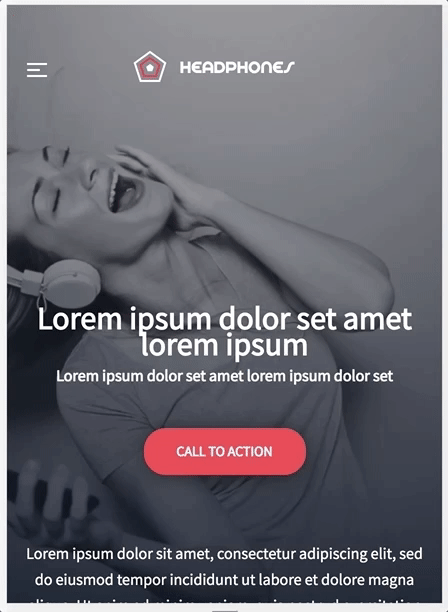
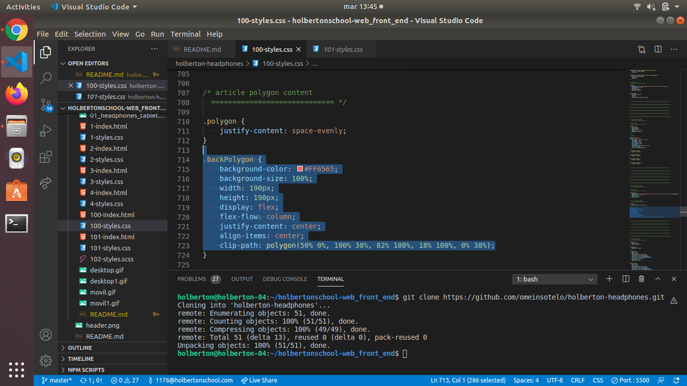
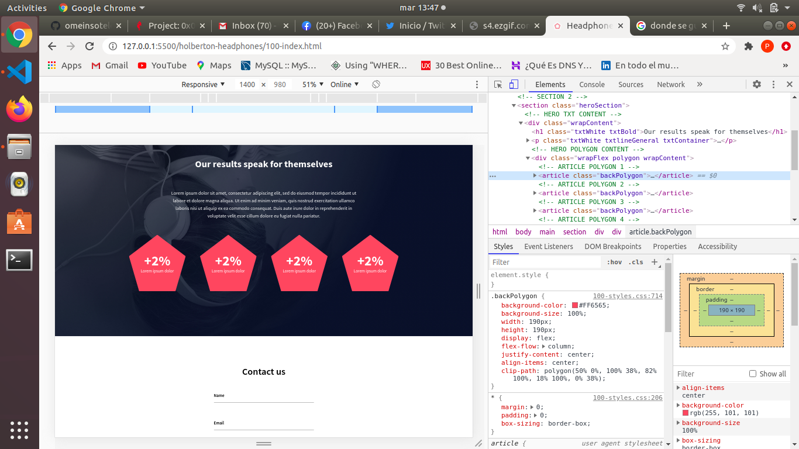
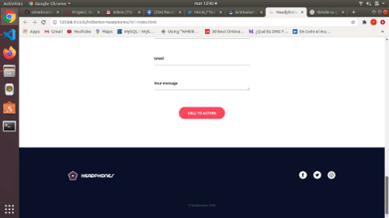

# Learning Objectives

> - In this project, you will implement from scratch, without any library, a web page. You will use all HTML/CSS/Accessibility/Responsive design knowledges that you learned previously.

> - You won’t have a lot of instruction, you are free to implement it the way that you want - the objective is simple: Have a fully functional web page that looks the same as the designer file.

# Requirements

> - You are not allowed to import external CSS framework (like Bootstrap).
> - You are not to use Javascript.

# Wireframe of the headphones project - desktop version (1400px)

# Wireframe of the headphones project - tablet version (768px)

# Wireframe of the headphones project - mobile version (480px)

# Tasks

**0. Read and be familiar with Figma**
File: [README.md](README.md/)
File: [figma](https://www.figma.com/file/lBZ0GxAphCHGoivtQEB2UX/Holberton-School---Headphone-company-(Copy)?node-id=0%3A1/)

**1. Header**
File: [0-index.html](0-index.html/)
File: [0-styles.css](0-styles.css/)

## Final rendering

**2. "What we do..." section**
File: [1-index.html](1-index.html/)
File: [1-styles.css](1-styles.css/)

**3. "Our results" section**
File: [2-index.html](2-index.html/)
File: [2-styles.css](2-styles.css/)

**4. Contact us**
File: [3-index.html](3-index.html/)
File: [3-styles.css](3-styles.css/)

**5. Footer**
File: [4-index.html](4-index.html/)
File: [4-styles.css](4-styles.css/)

## Final rendering

# headphones project - desktop version (1400px)

# headphones project - mobile version (480px)

**6. Replace image by... code!**
File: [100-index.html](100-index.html/)
File: [100-styles.css](100-styles.css/)

## Final rendering

**7. Let's animate items**
File: [101-index.html](101-index.html/)
File: [101-styles.css](101-styles.css/)

**8. And SASS??**
File: [102-styles.scss](102-styles.scss/)

# Author

> Paula Sotelo Vandamme

> [E-mail](omeinsotelo@gmail.com)

> [Github](https://github.com/omeinsotelo)

> [Twiiter](https://twitter.com/omeinsotelo)

> [Linkedin](https://www.linkedin.com/in/paula-sotelo-ba733a70/)
